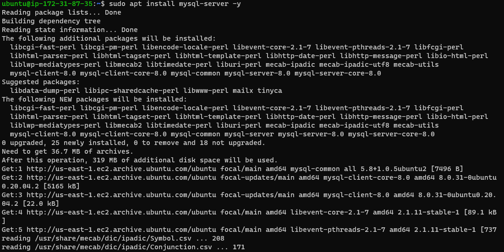
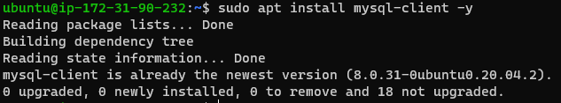
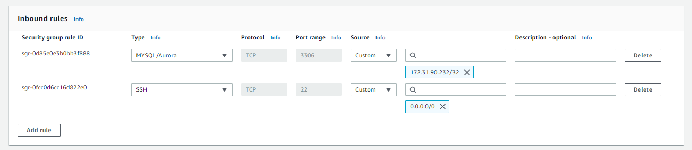
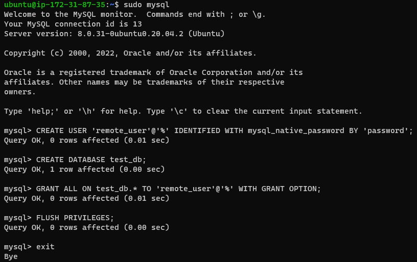
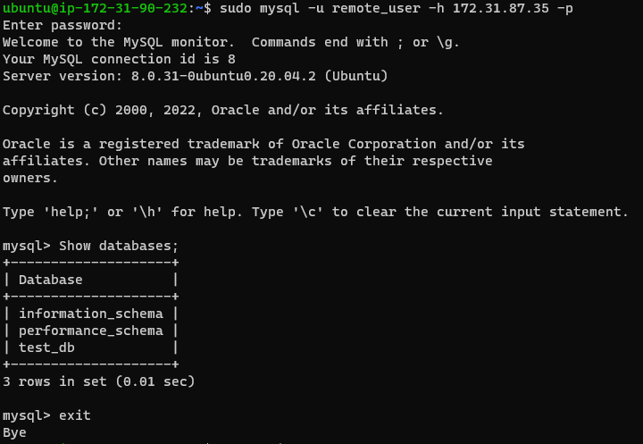

# CLIENT-SERVER ARCHITECHTURE

## This project is aimed at implemeting a client-server architecture using MySQL database management system.

I spinned 2 instanced (Linux-based virtual server)
    - mysql server
    - mysql client

I installed mysql server software on the mysql server Linux Server

 

...and installed mysql client software on the mysql client Linux Server

 

Opened a port 3306 for MySQL Server
 
 

Created a database named remote_user

 

I then configured MYSQL Server to allow remote host connection and replaced ‘127.0.0.1’ to ‘0.0.0.0’
 
 

I connected remotely to mysql server from mysql client. Then used 'Show databases;' to check connection.

 

